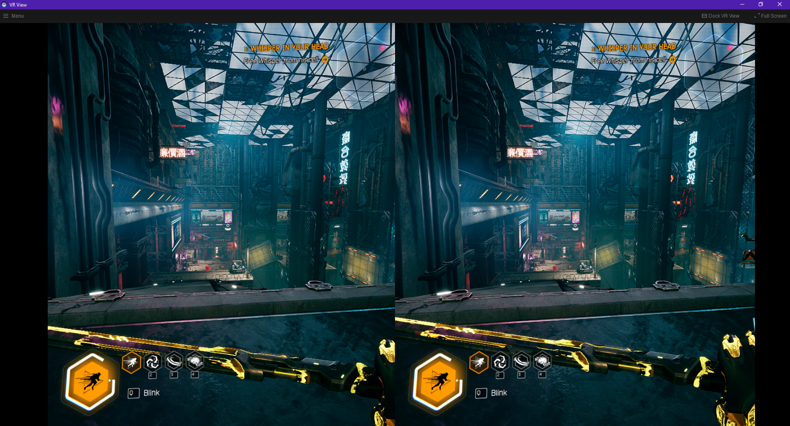

Back in November 2021, I played Ghostrunner for the first time. Sure, its fast-paced wallrunning and slash-and-dash mechanics appealed to my short Gen-Z attention span — but more importantly, the game’s ambiance, constructed through the beautifully dystopian Dharma City and anxiety-inducing cyberpunk soundtrack, enticed me to go back and attempt a 100% completion. I never got there, although I did find and collect every katana, because I soon started chasing a different goal: I wanted to play Ghostrunner in virtual reality.

It seemed simple enough: find a mod loader for Unreal Engine 4, reverse engineer the game binary, and load in one of Unreal Engine’s built-in VR cameras. It wasn’t that simple. First, there are a few mod loaders; I chose the most recently updated one, [Russell.J’s UnrealModLoader](https://github.com/RussellJerome/UnrealModLoader). Second, as it turns out, most UE4 games are not compiled and shipped with VR plugins, so it’s impossible to load in VR features on a whim. After a little digging, I came across the [Flatscreen to VR Modding Community Discord](http://flat2vr.com). There, some very helpful modders explained that unless Ghostrunner’s developers were willing to release modified binaries with the VR plugins baked in, what I wanted — my favorite game in VR — was nearly impossible.

You can guess how I responded:

> “Oh, this will be super rough then” — Me in #general on February 15

And I was right.

But first, let’s break down how our application will work. We need to create and link together a few components:

1. VR Interface: a way to send rendered frames, get head tracking data, and receive controller input

2. RHI (Rendering Hardware Interface): a way to hijack Unreal Engine’s RHI, such that we can render from the perspectives of both the left and right eyes using the headset’s resolution and field of view

3. Game Engine Interface: a way to send input to Unreal Engine if the user moves, presses a button, or otherwise needs to affect the game state

And of course, we need to package together those components in a way that can be injected into the game, preferably with a pretty interface. I’ll spoil the end a little; here’s how it looks:

And as of April 4 (a few days before this article will be released), it performs great, presenting games in full 3D with positional + rotational head tracking. There are still a few features to be implemented: input binding, DirectX 12 support, and so on (you can find a longer list of features at [unrealvr.dev](https://unrealvr.dev)); but overall, the end goal — Ghostrunner in VR — is absolutely doable. Additionally, the code I’ve developed should work for any other Unreal Engine 4/DirectX 11 games; it’s just a matter of testing them out and fixing minor bugs if necessary.

As the project progresses, I’ll continue releasing more articles here about the various techniques that have been developed for this mod: hacking the RHI, forwarding head-tracking input to the game engine, etc., so stay tuned for more!